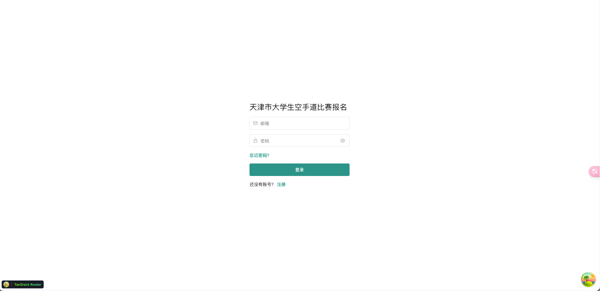
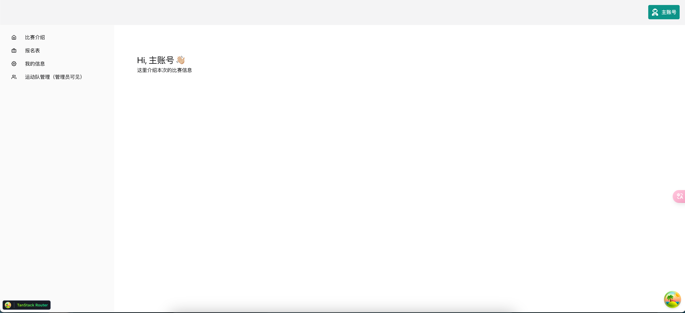
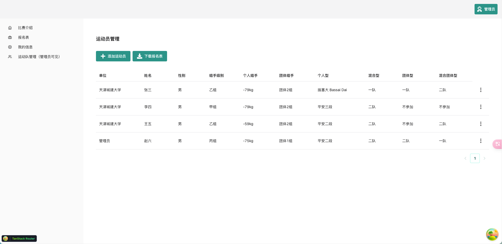
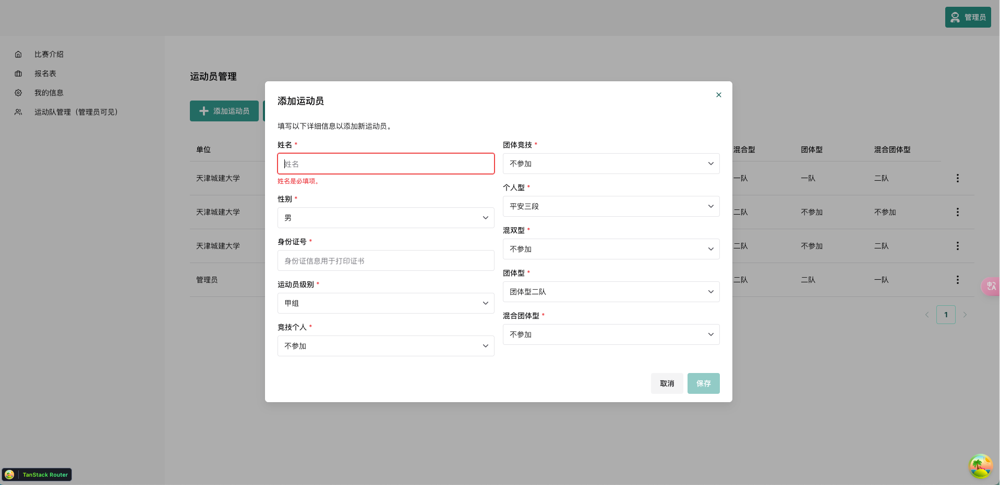
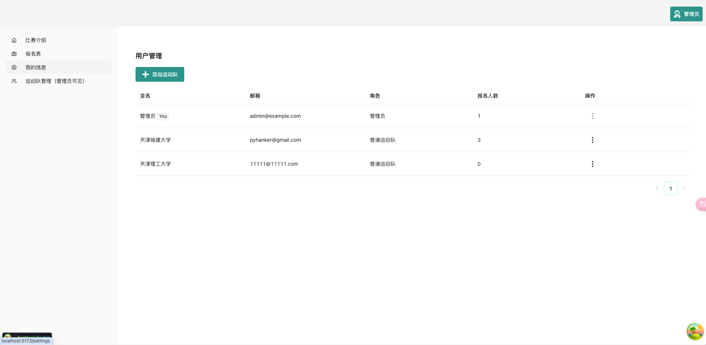

# Full Stack FastAPI Template

## 本项目Fock [FastAPI Template](https://github.com/fastapi/full-stack-fastapi-template.git)

## 安装部署
安装部署细节可参看原项目的[README.md](https://github.com/fastapi/full-stack-fastapi-template/blob/master/README.md)

## 说明
此项目主要用于天津市大学生空手道比赛报名系统，采集运动员报名信息 ，另一方面时本人学习react + typeScript + fastapi 框架
具体细节截图：
## 项目截图

